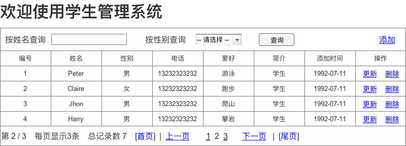
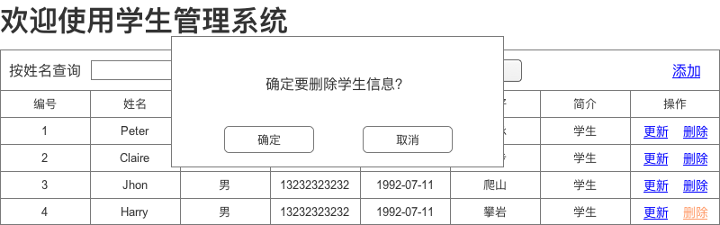
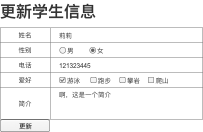
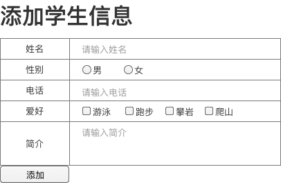

# 学生管理系统PRD

## 需求概述

实现学生信息的增、删、查、改，并分页展示信息。

## 需求描述

### 主页

#### 原型

#### 需求描述

1. 头部：实现学生信息的查询、添加功能
	1. 查询功能
		1. “按姓名查询”、“按性别查询”可以为空，此时点击“查询”按钮，查出所有学生信息，并展示在页面中部。
		2. “按姓名查询”、“按性别查询”不全为空时，按照选择的条件，从数据库内查出符合条件的学生，并将信息展示在页面中部。
		3. “按姓名查询”是模糊查询，姓名字段内包含输入信息的学生，都会被查询出来
		4. “按性别查询”只有3个选项：[-- 请选择 --]（表示为空）、[男]、[女]
	2. 添加功能
		1. 点击添加，跳转到“添加学生信息”页面。
		2. 添加完信息后，返回“主页”，并按添加时间倒序显示学生信息。
2. 中部：显示学生信息，并展示可以对学生做的操作
	1. 更新操作
		1. 点击“更新”，跳转到“更新学生信息”页面
		2. 更新完信息后，跳转到更新前的页面，展示最新的学生信息
	2. 删除操作
		1. 点击“删除”，弹出删除提示弹框。内容显示“确定要删除学生信息？”
		2. 点击“确定”，删除学生信息，并在当前页面显示最新信息。
		3. 点击“取消”，取消本次操作。页面不变。
3. 底部：展示分页信息。展示内容依次如下：
	1. 当前页数/总页数。当前页数表明当前是第几页。
	2. 每页显示的信息条数
	3. 总记录数
	4. 首页、上一页、每页、下一页、尾页的链接。点击后跳转到对应页面。当前页面的链接不可点。

### 更新学生信息页

#### 原型

#### 需求描述

入口：主页中部 --> 学生信息 --> 更新链接

作用：更新某个信息的信息

1. 页面上各字段显示学生原有的信息。
2. 填写新内容后，点击“更新”按钮，回到原页面，并展示更新后的信息

### 添加学生信息页

#### 原型

#### 需求描述

入口：主页头部右上角 --> 添加链接

作用：添加新学生的信息

1. 页面上各字段显示的默认信息如图片所示。
2. 填写新内容后，点击“添加”按钮，回到主页面，按添加时间展示全部学生信息。